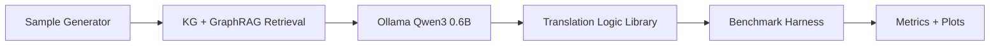

# ISynKGR (Industrial Semantic Knowledge Graph Reasoner)

ISynKGR is a reproducible, Dockerized benchmarking framework for industrial standard translation across IEEE 1451, ISO 15926, IEC 61499, OPC UA (IEC 62541), and AAS (IEC 63278).

## Architecture



## Quickstart

```bash
make up
make gen-samples
make bench
make down
```

## Docker-only workflow

- `docker compose run --rm isynkgr-gen-samples` generates 100 samples/standard + deterministic GT.
- `docker compose run --rm isynkgr-bench` runs ISynKGR + baselines and writes `output/benchmarks/<timestamp>/`.

## Reproducibility controls

- Fixed global seed (`145162578`)
- Fixed prompt template in `prompts/v1/`
- File-based LLM cache in `cache/llm`
- Pinned dependency lock (`requirements.lock`)
