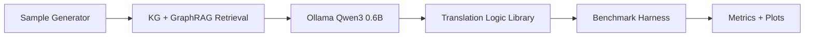

# ISynKGR (Industrial Semantic Knowledge Graph Reasoner)

ISynKGR is a reproducible, Dockerized benchmarking framework for industrial semantic translation across IEEE 1451, ISO 15926, IEC 61499, OPC UA (IEC 62541), and AAS (IEC 63278).

## Project layout

The framework is isolated in its own package folder:

- `isynkgr/` → core framework code (LLM adapter, retrieval, data generation, benchmark harness)
- `docker/` + `docker-compose.yml` → container runtime
- `prompts/` → versioned deterministic prompts
- `data/demo_sources/` → minimal in-repo source snapshots
- `scripts/` → cross-platform entrypoints (`.py`, `.ps1`, `.cmd`)

## Architecture



## Quickstart (Docker + system Ollama)

1. Install and start Ollama on the host system.
2. Pull the model once on host: `ollama pull qwen3:0.6b`
3. Run:

```bash
make up
make gen-samples
make bench
make down
```

## Windows support

You can run directly with Docker Compose on Windows (PowerShell/CMD):

```powershell
ollama serve
ollama pull qwen3:0.6b
docker compose run --rm isynkgr-gen-samples
docker compose run --rm isynkgr-bench
docker compose down -v
```

Optional helper scripts:
- PowerShell: `scripts/gen_samples.ps1`, `scripts/run_bench.ps1`
- CMD: `scripts/gen_samples.cmd`, `scripts/run_bench.cmd`

## Reproducibility controls

- Fixed global seed (`145162578`)
- Fixed prompt template in `prompts/v1/`
- File-based LLM cache in `cache/llm`
- Pinned dependency lock (`requirements.lock`)
- Deterministic output refresh to `output/benchmarks/latest` (directory copy, no symlink)


## Ollama connection

Containers connect to host Ollama via `OLLAMA_BASE_URL` (default: `http://host.docker.internal:11434`).
Override if needed:

```bash
OLLAMA_BASE_URL=http://localhost:11434 docker compose run --rm isynkgr-bench
```
