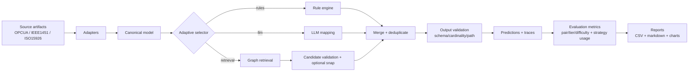

# ISynKGR

ISynKGR is an industrial schema-mapping benchmark and translation framework that combines:
- rule-based mapping,
- retrieval-driven candidate discovery,
- optional LLM mapping,
- and reproducible evaluation/reporting.


## Architecture


```mermaid
flowchart LR
    A[Source artifacts<br/>OPCUA / IEEE1451 / ISO15926] --> B[Adapters]
    B --> C[Canonical model]
    C --> D{Adaptive selector}
    D -->|rules| E[Rule engine]
    D -->|retrieval| F[Graph retrieval]
    D -->|llm| G[LLM mapping]
    F --> H[Candidate validation + optional snap]
    E --> I[Merge + deduplicate]
    G --> I
    H --> I
    I --> J[Output validation<br/>schema/cardinality/path]
    J --> K[Predictions + traces]
    K --> L[Evaluation metrics<br/>pair/tier/difficulty + strategy usage]
    L --> M[Reports<br/>CSV + markdown + charts]
```

## What the framework does

Given source artifacts (e.g., OPC UA / IEEE1451 / ISO15926-like inputs), ISynKGR produces mapping predictions into target standards (e.g., AAS / IEC61499-like targets), validates those predictions, and evaluates performance and failure modes.

Core modules:
- `isynkgr/` — adapters, pipeline, retrieval, rules, validation.
- `benchmark/` — orchestration, dataset materialization, evaluation, report generation.
- `docs/` — scenario definitions and implementation notes.

## Scenarios

The full run executes these scenarios:
- `full_framework`
- `rule_based_only`
- `llm_only`
- `rag_only`
- `embedding_similarity`
- `ablation_no_rules`
- `ablation_no_retrieval`
- `ablation_no_graph_expansion`
- `ablation_no_llm`
- `ablation_no_reasoning_prompt`
- `ablation_no_community_filter`
- `ablation_no_parallel_retrieval`

Scenario component toggles are documented in `docs/SCENARIO_MATRIX.md`.

## Metrics produced

For each scenario/seed the pipeline exports:
- precision / recall / f1
- validity_pass_rate
- transform_correctness
- retrieval_recall_at_1, retrieval_recall_at_5
- retrieval_hit_at_1, retrieval_hit_at_5
- latency_per_sample_s
- runtime_per_scenario_s
- token_usage_prompt / token_usage_completion
- memory_peak_mb
- confidence_calibration_error
- pred_count / gt_count / matched_count

And stratified outputs:
- per-pair
- per-tier
- per-difficulty
- per-mapping-type

Error taxonomy and validation-reason exports are written per scenario seed (`error_analysis.json`, `error_summary.json`) and aggregated in report tables.

## Run the benchmark

### Docker (full workflow)

```bash
docker compose up --build full-run
```

### Equivalent local Python command

```bash
PYTHONPATH=. python -m benchmark.orchestrate
```

Both execute the same top-level workflow:
1. dataset validation/materialization,
2. multi-scenario + multi-seed execution,
3. evaluation,
4. report export.

## Where outputs are saved

Primary artifacts:
- `artifacts/run_<timestamp>/pairs/<SOURCE>__TO__<TARGET>/dataset.jsonl`
- `artifacts/run_<timestamp>/pairs/<SOURCE>__TO__<TARGET>/ground_truth.jsonl`
- `artifacts/run_<timestamp>/pairs/<SOURCE>__TO__<TARGET>/results/<scenario>/seed<seed>/...`
- `artifacts/run_<timestamp>/metrics.json`
- `artifacts/run_<timestamp>/tables/*.csv`
- `artifacts/run_<timestamp>/plots/*.png`
- `artifacts/run_<timestamp>/report.md`
- `artifacts/run_<timestamp>/report.html`

Per-pair convenience outputs are also mirrored under `results/<SOURCE>__TO__<TARGET>/<scenario>/seed<seed>/`.

## Reproducibility notes

- Seeds are fixed in the full workflow (`11, 23, 37`).
- Scenario flags are explicit and versioned.
- Reports are generated from exported artifacts (no manual metric editing).
- Limitations are documented in `docs/IMPLEMENTATION_DIAGNOSIS.md`.
