# ISynKGR

> **Industrial Semantic Knowledge Graph Reasoner**
>
> A practical framework for standards-aware artifact translation using a hybrid approach:
> **rules + adapters + retrieval (GraphRAG/vector) + LLM integration + deterministic evaluation**.

ISynKGR helps you translate data and mappings across industrial standards (AAS, OPC UA, IEC 61499, IEEE 1451), validate outputs, and benchmark pipelines end-to-end with reproducible metrics.

---

## Why ISynKGR?

Industrial interoperability projects fail when translation quality is hard to measure and harder to reproduce. ISynKGR is designed to solve that by combining:

- **Deterministic validation** (schema and path validation)
- **Composable translation pipelines** (rule-only, graph-only, rag-only, llm-only, hybrid)
- **Benchmark harness** with scenario execution and scoring
- **Containerized workflow** for repeatable local/CI execution

---

## Architecture

```mermaid
flowchart LR
    %% Custom Colors and Styles (Slightly rounder corners rx:8 for a modern card look)
    classDef input fill:#e0f7fa,stroke:#00bcd4,stroke-width:2px,color:#006064,rx:8,ry:8
    classDef core fill:#ede7f6,stroke:#673ab7,stroke-width:2px,color:#311b92,rx:8,ry:8
    classDef engine fill:#fff3e0,stroke:#ff9800,stroke-width:2px,color:#e65100,rx:8,ry:8
    classDef merge fill:#e8eaf6,stroke:#3f51b5,stroke-width:2px,color:#1a237e,rx:8,ry:8
    classDef out fill:#e8f5e9,stroke:#4caf50,stroke-width:2px,color:#1b5e20,rx:8,ry:8
    classDef metric fill:#fce4ec,stroke:#e91e63,stroke-width:2px,color:#880e4f,rx:8,ry:8

    %% 1. Ingestion (Left Side)
    A["📥 Inputs<br><small>AAS / OPC UA<br>IEC61499 / IEEE1451</small>"]:::input
    B["🔌 Adapters<br><small>isynkgr/adapters</small>"]:::core
    C["📦 Canonical Model<br><small>isynkgr/canonical</small>"]:::core

    A --> B --> C

    %% 2. Processing (Middle)
    subgraph Processing["⚙️ Processing Engines"]
        D1["📜 Rule Engine<br><small>isynkgr/rules</small>"]:::engine
        D2["🔍 Retrieval<br><small>vector + GraphRAG</small>"]:::engine
        D3["🤖 LLM Integration<br><small>Ollama client</small>"]:::engine
    end

    C --> D1 & D2 & D3

    E["🔀 Pipeline<br>Variants"]:::merge
    D1 & D2 & D3 --> E

    %% 3. Output Pipeline (Right Side - Folded vertically for compactness!)
    subgraph Delivery["🏁 Delivery & Evaluation"]
        direction TB
        F["📤 Translation<br><small>Mappings + Entities</small>"]:::out
        G["✅ Validation<br><small>Schema + Path</small>"]:::out
        H["📊 Evaluation<br><small>Metrics + Reports</small>"]:::metric
        I["📄 Final Artifacts<br><small>JSON + MD + Charts</small>"]:::metric
        
        F --> G --> H --> I
    end

    E --> F

    %% Subgraph Styling
    style Processing fill:#f5f5f5,stroke:#bdbdbd,stroke-width:2px,stroke-dasharray: 4 4,rx:10,ry:10
    style Delivery fill:#f5f5f5,stroke:#bdbdbd,stroke-width:2px,stroke-dasharray: 4 4,rx:10,ry:10
```



### Pipeline modes

- `rule_only`
- `graph_only`
- `rag_only`
- `llm_only`
- `hybrid`

Each mode can be benchmarked under the same dataset and metric contract to compare quality and cost/performance trade-offs.

---

## Repository layout

- `isynkgr/` – core library (adapters, canonical model, pipeline, retrieval, rules, validation)
- `benchmark/` – benchmark orchestration, harness, metrics, report generation
- `examples/` – quick translation examples
- `scripts/` – helper scripts for sample generation and benchmark execution
- `docs/` – architecture, benchmark notes, datasets, extension guidance
- `docker-compose.yml` – reproducible benchmark services

---

## Installation

### Local editable install

```bash
pip install --no-build-isolation -e .
```

### With development tools

```bash
pip install --no-build-isolation -e .[dev]
```

---

## CLI entry points

After installation, these commands are available:

- `isynkgr-gen-samples` – generate synthetic samples + ground truth + validation
- `isynkgr-benchmark` – run benchmark execution entry point

---

## Quickstart

### 1) Run tests

```bash
PYTHONPATH=. pytest -q
```

### 2) Run a small benchmark locally

```bash
PYTHONPATH=. python -m benchmark.harness
```

### 3) Run a full containerized pipeline

```bash
docker compose up --build full-run
```

---

## Docker services and Makefile targets

The Makefile docker targets are aligned to compose services:

- `make docker-sample-validate` → `sample-validate`
- `make docker-full-run` → `full-run`
- `make docker-run-scenario` → `run-scenario`
- `make docker-evaluate` → `evaluate`
- `make docker-report` → `report`

---

## Benchmark flow

1. **Sample validation** (`sample-validate`) confirms generated datasets are structurally valid.
2. **Scenario execution** runs one or more translation modes.
3. **Evaluation** computes matching/quality metrics.
4. **Report generation** merges outputs into final consumable artifacts.

Default scenario family used in full orchestration:

- `baseline`
- `full_framework`
- `ablation_no_graphrag`
- `ablation_no_parallel`
- `ablation_no_community`
- `ablation_no_reasoning`

---

## Outputs

Typical outputs appear under `results/`:

- `results/<scenario>/predictions/mappings.jsonl`
- `results/<scenario>/metrics.json`
- `results/<scenario>/logs/run.log`
- `results/final/report.md`
- `results/final/metrics_merged.json`
- `results/final/charts/*.png`

---

## Determinism and reproducibility

ISynKGR is built for reproducible experiments:

- fixed `SEED` support
- explicit `MODEL_NAME`
- persisted resolved config per run
- logged execution artifacts

---

## Path validation guarantees

ISynKGR validates mapping `source_path` and `target_path` with protocol-specific regex patterns:

- **AAS**: `aas://{aas_id}/submodel/{sm_idShort}/element/{path...}`
- **OPC UA**: `opcua://ns={ns};s={string_id}` or `opcua://ns={ns};i={int_id}`
- **IEC 61499 (subset)**: `iec61499://{device}/{resource}/{fb}/{var}`
- **IEEE 1451 (subset)**: `ieee1451://{ted_id}/{channel}/{field}`

Validation is fully anchored and designed to avoid pathological backtracking.

---

## Documentation

- `docs/ARCHITECTURE.md`
- `docs/BENCHMARKS.md`
- `docs/DATASETS.md`
- `docs/BASELINES.md`
- `docs/EXTENDING.md`

---

## License

Distributed under the MIT License. See `LICENSE`.
